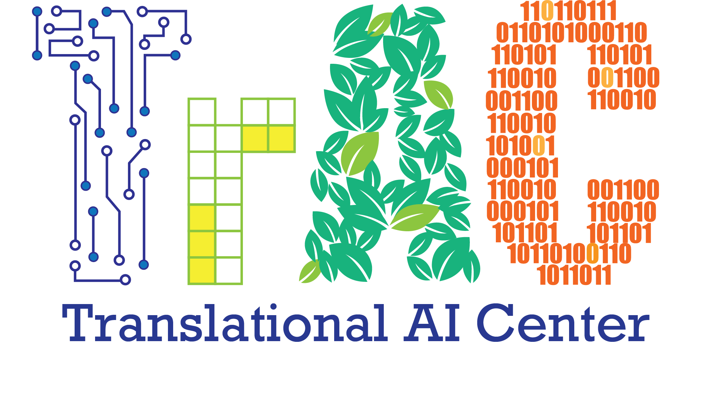

<!-- <h2 style="text-align: center;">Welcome to TrAC Training on </h2>
<h1 style="text-align: center;">Demystifying Trending AI Techniques</h1> -->

# Welcome to the TrAC ADLRG Mini-Course on
# Computer Vision & Self-supervised Learning

 

  

Hi all! welcome to TrAC ADLRG Mini-Course on **Computer Vision & Self-supervised Learning**. 
 
 
**Date**: Aug 28th, Sept. 4, 11, and 18, 2023
 
**Time**: 4 PM – 6 PM
 
**Venue**: Zoom
## Before you get started, please read our:

1. [:material-scale-balance: Code of Conduct](./getting_started/code_conduct.md)

2. [:fontawesome-solid-gears: Logistics](./getting_started/logistics.md)

3. [:material-timetable: Schedule](./getting_started/schedule.md)

4. [:book: Tutorial Slides](https://iastate.app.box.com/folder/206870078491)

5. [:material-bookmark: External Resources](./sections/resources.md)

-----------------------------------------------------------------------
